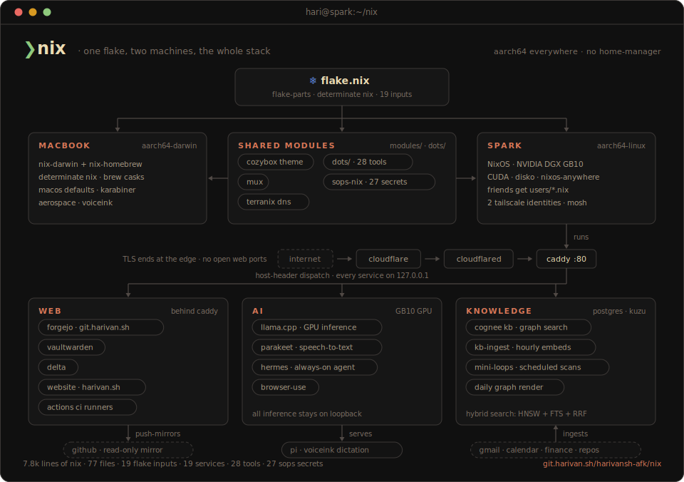

<p align="center">
  
</p>

One flake, two machines, declared with [flake-parts](https://github.com/hercules-ci/flake-parts) and managed by [Determinate Nix](https://docs.determinate.systems/determinate-nix/):

| host | hardware | system | role |
|---|---|---|---|
| `macbook` | MacBook (aarch64-darwin) | nix-darwin + nix-homebrew | dev workstation |
| `spark` | NVIDIA DGX Spark, GB10 (aarch64-linux) | NixOS | shared server |

## The tour

**Edge** - internet traffic hits Cloudflare (TLS terminates there), rides a cloudflared tunnel to Caddy on `127.0.0.1:80`, and gets dispatched by Host header to services bound on loopback. No open web ports, no ACME. DNS for the zone is nix too, via [terranix](https://github.com/terranix/terranix) (`just dns-plan` / `just dns-apply`).

**Services on spark** - [Forgejo](https://git.harivan.sh) with a Pierre-themed frontend, Actions runners, and push-mirrors back to GitHub; Vaultwarden; Delta; the harivan.sh site; `llama.cpp` inference on the GPU; Whisper Large v3 speech-to-text; the Hermes always-on agent; a Cognee knowledge graph with hybrid search over mail, calendar, finance, and repos; mini-loops scheduled scans; browser automation. Each one is a module in `modules/services/`.

**mux** - tmux is gone. Sessions, panes, and windows live in Neovim: one detached headless server per project, thin `--remote-ui` clients, mksession persistence across reboots, and a federated session picker across every host. `mosh spark` lands you straight in a session. The whole thing ships as a portable flake package: `nix profile add git+https://git.harivan.sh/harivansh-afk/nix#mux`.

**Theme** - [cozybox.nvim](https://git.harivan.sh/harivansh-afk/cozybox.nvim) is the palette for everything: `lib/theme.nix` renders configs for ghostty, fzf, lazygit, bat, zsh, omp, the prompt, and the wallpaper. `theme` flips dark/light everywhere, live, including running nvim instances.

**Dotfiles** - no home-manager. Plain files in `dots/` are symlinked into place by an activation script: the owner's links point at the live checkout so edits apply without a rebuild, guests get the nix-store copy. 28 tools configured from one tree.

**Secrets** - [sops-nix](https://github.com/Mic92/sops-nix) with age recipients derived from each host's SSH key. Per-admin path rules in `.sops.yaml` let friends own and rotate their secrets without being able to read anyone else's.

## Spark

Spark is a shared NixOS workstation: friends who want access get a user definition in `users/`, and every user gets the shared dotfile setup from `modules/users/`.

NVIDIA kernel, drivers, and container support come from the upstream [nixos-dgx-spark](https://github.com/graham33/nixos-dgx-spark) module. Disks are declared with [disko](https://github.com/nix-community/disko); from-scratch provisioning goes through [nixos-anywhere](https://github.com/nix-community/nixos-anywhere).

`spark` resolves on the personal tailnet and is the normal SSH/mosh entry point. It runs two Tailscale identities:

- `spark-ix` on the Indexable tailnet for shared service routing and Funnel/Serve
- `spark` on the personal tailnet for admin SSH and personal access

Use `ssh spark-lan` only for direct LAN access on shared network.

Spark local inference runs Pi against `llama.cpp` on `127.0.0.1:8080`.

The Cognee knowledge graph (`modules/services/kb-graph.nix`) rebuilds daily at 04:00 and renders to `/var/lib/kb/graph/index.html`. It is deliberately not served on any network or tailnet - view it from a spark shell with `open kb-graph.html` (the repo-root symlink, spark-only) which streams it to the Mac.

## Structure

```
flake.nix          entrypoint - inputs and outputs
flake/             host assembly, devshell, args
lib/               host metadata, theme palette
inventory/         typed host inventory via evalModules
hosts/             per-host config (macbook/, spark/)
users/             multi-user definitions for spark
dots/              app configs symlinked into XDG paths (live-editable)
modules/           reusable modules (services, security, users/dotfiles)
system/            shared system-level config and packages
scripts/           runtime scripts wired via modules/users/user-config.nix
secrets/           sops-encrypted secrets per host
terraform/         declarative Cloudflare DNS via terranix
assets/            readme artwork
```

## Usage

```
just switch              rebuild the current machine
just switch-spark        rebuild spark remotely
just check               nix flake check
just fmt                 nixfmt-tree
just sops-edit FILE      edit a secret
just dns-plan            preview Cloudflare DNS changes
```
